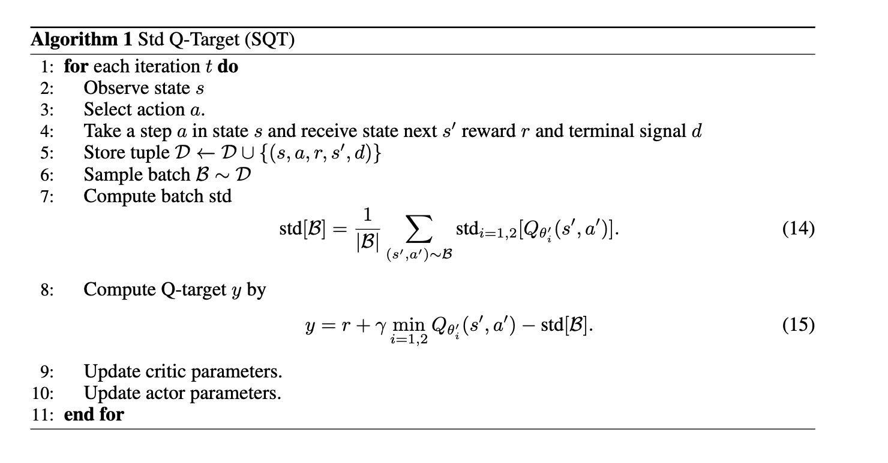
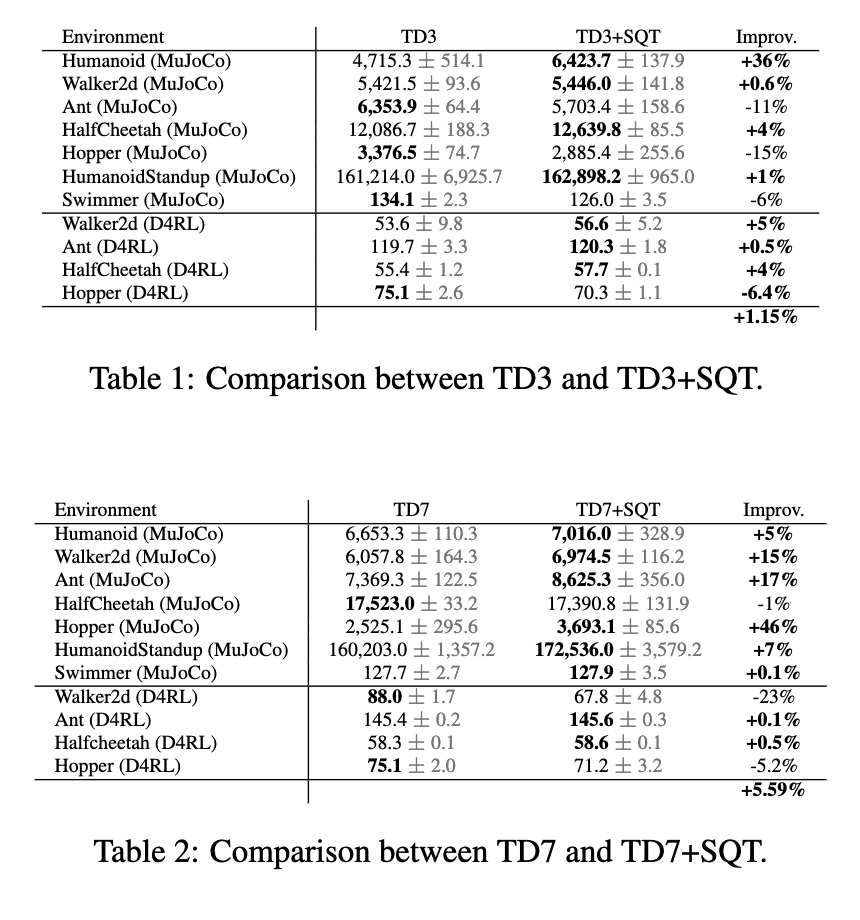

# Conservative Reinforcement Learning by Q-functions disagreement

# TL;DR: 
We provide a new regularization term based on std of critic Q-function and show that this regularization leads to an improved performance in many SOTA algorithms.

# Abstract
In this paper we propose a novel continuous-space RL algorithm that subtracts the Q-target network standard deviation from a Q-target network which leads to forcing a tighter upper-bound on Q-values estimation. We show in experiments that this novel Q-target formula has a performance advantage when applied to algorithms in this space such as TD3, TD7, MaxMin, REDQ, etc., where the domains examined are control tasks from MuJoCo simulation.

# Std Q-Target

SQT algorithm has one-core component: Std Q-Target formula, which is, min Q-values minus Std Q-values. Double Q-learning proved that its two Q-functions converge to a single fixed point, thus, their Std converges to 0. To obtain safe Q-values, we reduce Q-functions Std from the min Q-values. While the min Q-values reflecting a ”wide consensus” Q-values, the Std Q-values reflecting a Q-values ”disagreement”, and thus, the min Q-values minus the Std Q-values reflecting safe Q-values. We show that SQT formula grants a clear performance advantage to TD3/TD7 on experiments. We also believe that SQT formula can grant a performance advantage to any ensemble RL algorithm.





# Installation

```
Gym 0.23.1
MuJoCo 2.3.6
PyTorch 2.0.0
Python 3.10.9
```

# How to run it

Run an experiment by `run.sh` file.

```
sh ./run.sh <policy> <env> <offline> <t_switch> <alpha>
```

Policy can be any combination of one of the baselines, TD3, TD7, MaxMin and REDQ, solely, or with SQT combined with `+`.

```
sh ./run.sh TD7+SQT Walker2d-v2 0 100000 1
```

# Credits

Our code is based on the code of TD7.

`https://github.com/sfujim/TD7`
